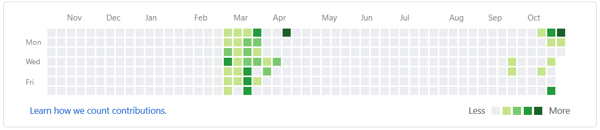

### Whatever you do, don't burnout.

My previous post was posted on October 22nd, 2017 and the one before that was posted on March 13th... 

What happened? _I burned out._ 

I was doing pretty well, making good progress on P1xt's excellent [web development guide](https://github.com/P1xt/p1xt-guides/blob/master/wd-cs.md). I managed to balance working 40 hours a week, lifting 6 hours a week in the gym, studying and coding 20 hours a week, and maintaining a relationship with my girlfriend and friends. I even kept my place somewhat tidy, read books, and played the occasional video game. I maintained this for about 6 months, keeping a log of everything I did and how long I did it in Evernote. Here's an example.

Not bad, right? Then I burned out. It turns out reading [_You Don't Know JavaScript_](https://github.com/getify/You-Dont-Know-JS) week after week gets pretty stale. I didn't code or study for five months. Now I'm back to the beginning, redoing lessons and tutorials (albiet with ease).

What did I learn? 

_**You can burnout even if you have discipline.**_

Maybe you're thinking, "Hey Richard, discipline is doing things even when you don't want to do them. Maybe you just weren't disciplined to keep going after six months."

And you know what, I thought that too. I felt guilty for awhile. 

Have you ever heard of this quote?

> Screw motivation, what you need is discipline.

I don't know who came up with it, but that's not important. It refers to how motivation is a temporary feeling that comes and goes, while discipline is what get things done. It's ironically motivating, isn't it? 

It's a good quote because it's true. As Aristotle once said, _"We are the sum of our actions..."_

That said, what happens when you do the same thing over and over again? You get sick of it. Then you burnout. How can you have a career as a programmer if you're sick of coding? 

I'm currently reading [_Breaking BUD/S: How Regular Guys Can Become Navy SEALs_](https://www.amazon.com/Breaking-BUD-Regular-Become-SEALs/dp/1484087151) by DH Xavier, which essentially tells you what you should do if you want to pass BUD/S and become a Navy SEAL. I recommend it if you're interested in improving your mental toughness.

Navy SEALs are the Navy's primary special operations force. You probably know them as the guys who killed Bin Laden. BUD/S, or Basic Underwater Demolition/SEAL training is the basic training to become a Navy SEAL and probably one of the hardest things you could do.

Xavier, who used to be a SEAL, gives some tips on how to get to pass the PST (Physical Screening Test) which is necessary to get to BUD/S. He emphasizes the **necessity of variety** in your workout routine.

> If you were to work out 4-5 days every week for a year and do nothing but the PST exercises, you would hate your life. You would hate working out. When you hate something, it's much easier to stop doing it. **It's not mental weakness, it's human nature.**

Words of wisdom from someone part of an extremely disciplined and tested warrior culture. This is probably obvious to a lot of you out there, but if you're like me, where you regiment your life and try to follow a curriculum to a T, then you need to hear this. **Don't guilt yourself for burning out. Know that it happens and there are ways to prevent it.**

### How do you know you're burning out?

When you take a break and can't get back into things. At least that's what happened to me. Breaks are fine unless they go on for weeks at a time.

### What can I do to prevent burnout?

Like I mentioned above, you need variety. Stop whatever you're doing and do something fun and different but related to code.

P1xt's ["I need more practice" section](https://github.com/P1xt/p1xt-guides/blob/master/wd-cs.md) actually makes a great "try one of these if you think you're burning out" list.

There's [codingame](https://www.codingame.com), where well... you play games to learn code. It's a fun way to get away from the routine of studying a textbook and using what you've learned. It's certainly better than doing nothing.

Or how about the suggestion to join a coding cohort? You'd have a chance to make relationships with like-minded people who could also help you if you fall off the proverbial coding wagon and can't get back on.

As for myself, I have a local friend who's also coding and we've started asking each other what we're working on. Hopefully we’ll hold each other accountable in the future. I also plan on trying to get into a cohort soon.

The most important thing I've gained from this experience is self-awareness. I can be disciplined to a fault, and although that might sound like a humble-brag, I think my five months of coding inactivity suggest otherwise. Hopefully this helps like-minded people out there and myself at some point in the future.

Happy coding!