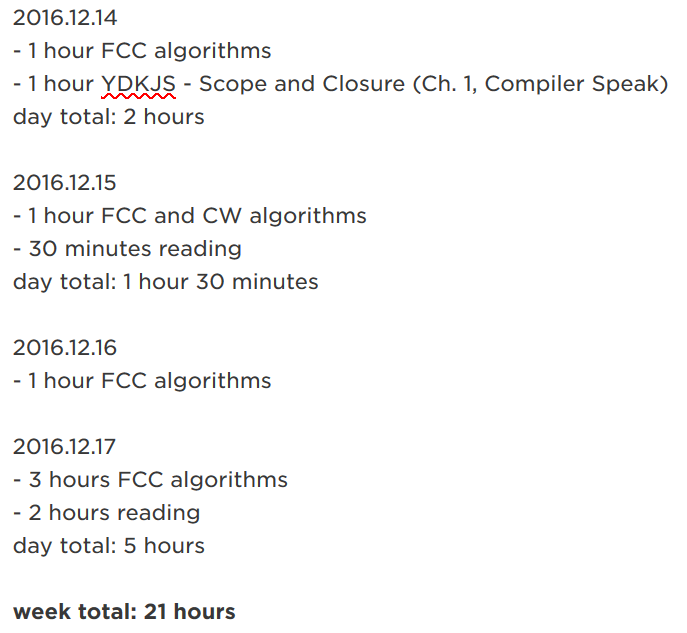

### Whatever you do, don't burn out.

My previous post was posted on October 22nd, 2017 and the one before that was posted on March 13th... 

What happened? _I burned out._ 

I was doing pretty well. I managed to balance working 40 hours a week, lifting 6 hours a week in the gym, studying and codying 20 hours a week, and maintaining a relationship with my girlfriend and friends. I even kept my place somewhat tidy, read books, and played the occassional video game. I maintained this for about 6 months, keeping a log of everything I did and how long I did it in Evernote. Not bad, right?

Then I burned out. Six months of no coding or studying. Now I'm back to the beginning, redoing lessons and tutorials (albiet with ease).

What did I learn? 

> _**You can burn out even if you have discipline.**_

Maybe you're thinking, "Hey Richard, discipline is doing things even when you don't want to do them. Maybe you just weren't disciplined to keep going after six months."

And you know what, I thought that too. I felt a little guilty. 

Have you ever heard of this quote, or some variation of it?

> Screw motivation, what you need is discipline.

I don't know who came up with it, but that's not the point. Essentially it refers to how motivation is a temporary feelin that comes and goes, while discipline is what get things done. It's ironically motivating, isn't it? 

It's a good quote because it's true. As Aristotle once said, _"We are the sum of our actions..."_

That said, what happens when you do the same thing over and over again? You get sick of it. Then you burn out. How can you expect to be a programmer for the rest of your life if you're sick of coding? 

I'm currently reading...
