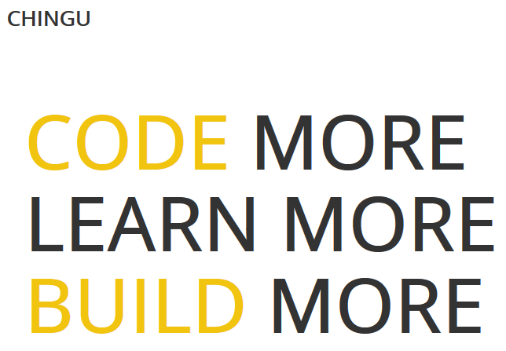
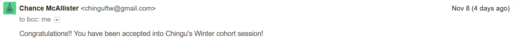
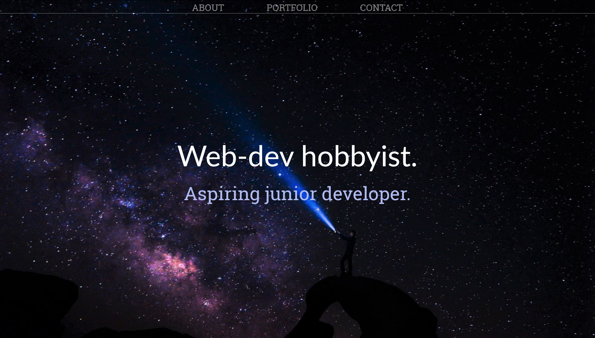

As part of my initiative to get some accountability to prevent burnout, I've applied to and have been accepted into a [Chingu cohort](https://chingu-cohorts.github.io/chingu-directory/)!

Yay! This is what Chingu cohorts is, according to their website:

> Chingu is a global collaboration platform and coding-cohort generator. We connect motivated learners with shared goals to learn, help and build together.

Basically you fill out an application and if you're accepted you're put into a group of motivated people learning to code. You study things and work on projects together. My cohort will be starting at the end of November. I'm looking forward to working on a project as a team, getting some accountability, and hopefully making some long-term relationships with people so we can help each other grow as coders.

Chingu cohorts has their own Medium page, which you can check out [here](https://medium.com/chingu).

As far as my coding studies go, I've finally finished my personal portfolio that I started earlier this year. You can find it at [https://ellereeeee.github.io](https://ellereeeee.github.io/).

Coming back to this after five months presented some challenges. One in particular was struggling to create a CSS overlay over my portfolio images until I realized I had coded for mobile first. Coding issues often seem silly in retrospect.

I had a lot of fun coming up with the design for the site and Shay Howe's [tutorial](https://learn.shayhowe.com/html-css/) on HTML and CSS was really helpful in keeping my code clean. My original goal for making my portfolio page again (I had made one once) was to practice writing code locally and using Git and GitHub in my workflow. It feels good to finish a project and achieve the initial goals I set out for.

Getting into a cohort and finishing my portfolio page gave me a nice confidence boost helped me get back into the habit of learning on a regular basis. Right now I'm re-reading [_You Don't Know JavaScript: Up and Going_](https://github.com/getify/You-Dont-Know-JS/tree/master/up%20%26%20going) and I plan on starting making a JavaScript calculator later this week.

Happy coding!