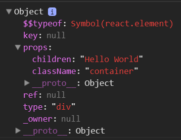
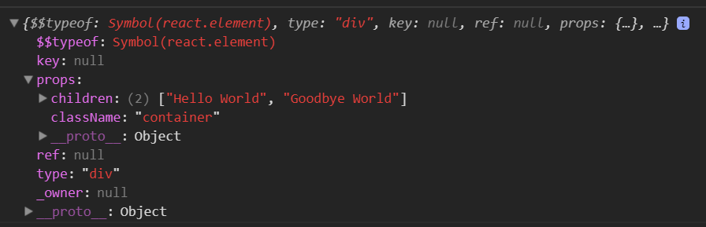
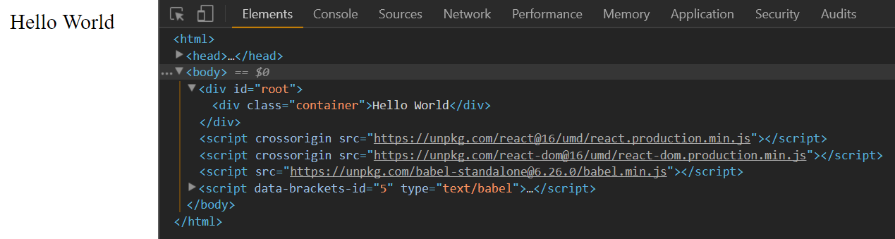
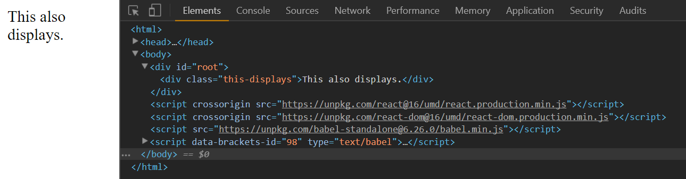

### Write Hello World with raw React APIs

This is the first part of my notes on egghead.io's [The Beginner's Guide to ReactJS](https://egghead.io/courses/the-beginner-s-guide-to-reactjs).

React is a framework that creates HTML and CSS through methods.

This code snippet below creates HTML and CSS with vanilla JavaScript:

```
<div id="root"></div> // make div
<script type="text/javascript">
  const rootElement = document.getElementById('root')
  const element = document.createElement('div') // make another div
  element.textContent = 'Hello World' // html to div
  element.className = 'container' // add class to div
  rootElement.appendChild(element) // nest new div in div with id "root"
</script>
```

First, we create a div with the id "root" with HTML. Then we write in JavaScript a constant (ES6 syntax) that is assigned that div. Next, we make another div with JavaScript, give it the text "Hello World", and give it a class name of "container." We then nest the new div inside the div with the "root" id.

The following code achieves the same thing in React:

```
<div id="root"></div>
<script crossorigin src="https://unpkg.com/react@16/umd/react.production.min.js"></script>
<script crossorigin src="https://unpkg.com/react-dom@16/umd/react-dom.production.min.js"></script>
<script type="text/javascript">
  const rootElement = document.getElementById('root')
//  const element = document.createElement('div')
//  element.textContent = 'Hello World'
//  element.className = 'container'
//  rootElement.appendChild(element)
  const element = React.createElement( // create another div with `createElement` method
    'div', 
    {className: 'container'},
    'Hello World'
  ) // the first argument is the element, the second is properties, the last is children
  ReactDOM.render(element, rootElement) // similar to append, element is rendered to rootElement
</script>
```

The commented out code from the first snippet is replaced in functionality by React. First we make a constant with **the `createElement()` method that takes three arguments: the HTML element, properties, and children of the element.** If we want, we can add more children. Last we have a **`render()` method that renders** `element` to `rootElement`.

What happens when we run `console.log(element);`?



The important thing to note is the `props` object. It contains the properties `children` and `className` which here corresponds to the inner HTML and CSS class name.

If we have more than one argument for the last parameter, we would have an array for `children`.

```
  const element = React.createElement( // create another div with `createElement` method
    'div', 
    {className: 'container'},
    'Hello World',
    'Goodbye World
```



The output would be the same if we wrote the array.

```
  const element = React.createElement(
    'div', 
    {className: 'container',
     children: ['Hello World', 'Goodbye World']
    })
```

The third parameter for children is for convenience.

### Use JSX with React

Although it is possible to write an app with just `React.createElement()`, it is not efficient. To remedy this, JSX was created. JSX is a customized markup language similar to HTML. It designed to provide familiarity and readability to the code-author. 

Let's rewrite our previous code with JSX.

```
<div id="root"></div>
<script crossorigin src="https://unpkg.com/react@16/umd/react.production.min.js"></script>
<script crossorigin src="https://unpkg.com/react-dom@16/umd/react-dom.production.min.js"></script>
<script type="text/javascript">
  const rootElement = document.getElementById('root')
//  const element = React.createElement(
//    'div', 
//    {className: 'container'},
//    'Hello World'
//  )
  const element = <div className="container">Hello World</div> // JSX!
  ReactDOM.render(element, rootElement)
</script>
```

If we run this we get a `SyntaxError` in the console. That's because the JSX line in the `script` tag needs to be JavaScript. We need to transpile JSX into the `React.createElement()` call. This is possible with the JavaScript transpiler [Babel](https://babeljs.io/).

We add the Babel standalone CDN after the React CDNs and change the script type to `text/babel`.

```
<script src="https://unpkg.com/babel-standalone@6.26.0/babel.min.js"></script>
<script type="text/babel">
```



It works!

Notice that while there are some similarities to HTML in the JSX, the class attribute is `className` instead of HTML's `class`.

You can use JavaScript with JSX by using string interpolation. String interpolation is how you display a variable in a string. For example, if you wanted to make the HTML "Hello World" an external variable you could do this:

```
  const content = 'Hello World'
  const element = <div className="container">{content}</div>
```

Whenever you use the curly braces `{}` you are not using JSX anymore, but JavaScript. Any JavaScript is valid as long as it is an expression. This is a powerful way to have your logic as part of your markup.

It is common to use interpolation and the spread operator `...` to make a props object. For example:

```
const props = {
  className: 'container',
  children: 'Hello World'
}
const element = (
  <div {...props} />
)
```
We make a props object then a self-enclosing React element with `{...props}`. This is similar to object spread in JavaScript. Here we are spreading `className` and `children` across the div.

The result is the same. `Hello World` is displayed on the browser.

If you need to override a property in the `props` object, you would either put the JSX property after the `{...props}` interpolation or between the div tags if its the HTML text.

For example: `const element = <div {...props} className="this-displays">This also displays.</div>`



To use JSX In a nutshell, you start JSX with the carat `<`. You specify the element you want to render like `div`. You add props like HTML elements, but remember the syntax is a little different. You add the children, then close the element tag.