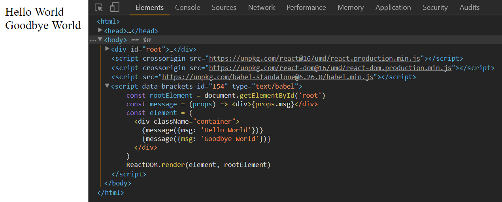
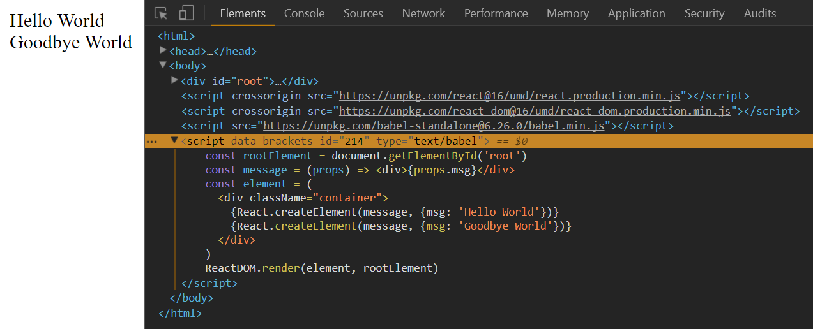
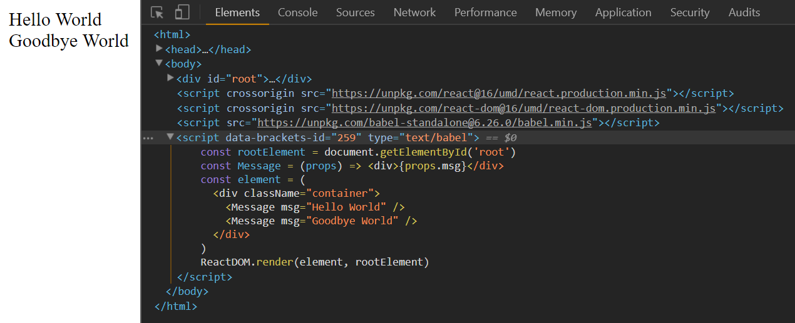

This is the second part of my notes on egghead.io's [The Beginner's Guide to ReactJS](https://egghead.io/courses/the-beginner-s-guide-to-reactjs).

### Create Custom React Components

In the code below we make two nested divs with "Hello World" with JSX and interpolation. 

```
<div id="root"></div>
<script crossorigin src="https://unpkg.com/react@16/umd/react.production.min.js"></script>
<script crossorigin src="https://unpkg.com/react-dom@16/umd/react-dom.production.min.js"></script>
<script src="https://unpkg.com/babel-standalone@6.26.0/babel.min.js"></script>
<script type="text/babel">
  const rootElement = document.getElementById('root')
  const helloWorld = <div>Hello World</div> // JSX!
  const element = (
    <div className="container">
      {helloWorld} // interpolation
      {helloWorld} // interpolate same thing
    </div>
  ) 
  ReactDOM.render(element, rootElement)
</script>
```

If we want the text to be different while reusing code, we could parameterize the code with functions.

We change `<div>Hello World</div>` by wrapping it in an arrow function and give that arrow function the parameter props. We also change the `const` name from `helloWorld` to `message` to reflect its reusability.

`const message = (props) => <div>{props.msg}</div>`

The arrow function returns the props object with the property msg all in an interpolation. The interpolation looks like this:

```
const element = (
  <div className="container">
    {message({msg: 'Hello World'})}
    {message({msg: 'Goodbye World'})}
  </div>
  )
```

We make a function call to message and pass in an object with the `msg` property and define the property value (`'Hello World'` or `'Goodbye World'` in this case).



In a nutshell, we take some JSX, wrap it in a function, and make a function call to message.

#### JSX Makes Functions More Readable

Let's make the function calls more readable with JSX.

Since JSX compiles down to `React.createElement()`, lets rewrite our code with `React.createElement()` first then rewrite the React code into JSX. This will helps us understand the JSX syntax.

`React.createElement()` can take not only a string like `'div'` as its first argument, but also a function. It will pass the props to the function and that function will render more elements. This would render a div with the same message as before

```
const element = (
  <div className="container">
    {React.createElement(message, {message: 'Hello World'})}
    {message({msg: 'Goodbye World'})}
  </div>
  )
```

We pass the object with the message property into the second props parameter with the values `'Hello World'` and `'Goodbye World'`.



When we changed a React `div` to JSX, we wrote it the same. However, if we do the same with `message` then Babel will render an empty element called `message` on the browser and not the function object we created.

JSX differentiates between DOM elements and variables by case. **Lower case are DOM elements and upper case are variables.**

First we'll need to make our `message` declaration uppercase: 

`const Message = (props) => <div>{props.msg}</div>`.

And then rewrite our function calls in JSX:

```
const element = (
  <div className="container">
    <Message msg="Hello World" />
    <Message msg="Goodbye World" />
  </div>
)
```



We could also change the props property to `children` and write out JSX like this.

```
const Message = (props) => <div>{props.children}</div>
const element = (
  <div className="container">
    <Message>Hello World</Message>
    <Message>Goodbye World</Message>
  </div>
)
```

The result would be the same.

#### TL;DR

To create a custom JX component that is resuable through your application you:
 
1) Create a variable that has a capital letter as the first character.
  
2) Assign an arrow function to it with the parameter `props`. Return the props as properties of the object `props` (ex. `props.children`).
  
3) You can use those props in whatever you return, such as a JSX div.
 
Use the variable with the arrow-functioned assigned to it as a JSX element.