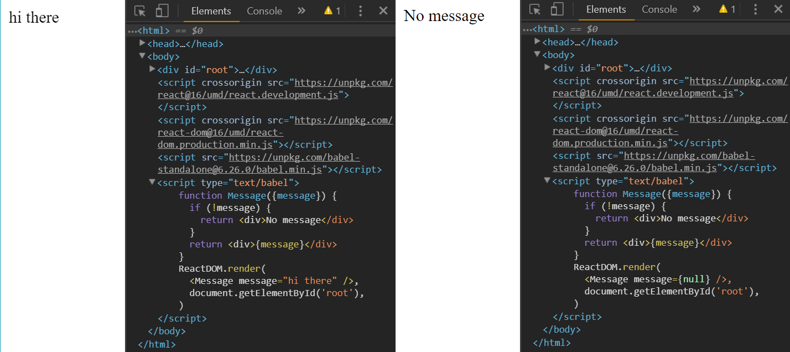
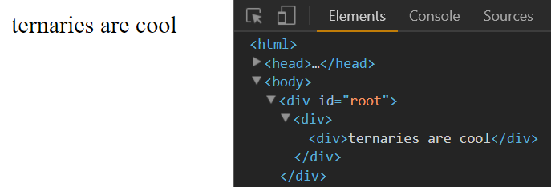
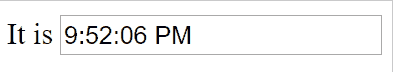
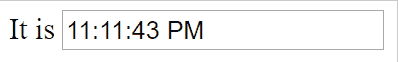

This is the third part of my notes on egghead.io's [The Beginner's Guide to ReactJS](https://egghead.io/courses/the-beginner-s-guide-to-reactjs).

### Conditionally Render a React Component

This section will explain why ternary operator expressions are common in rendering React components and how this would transpile from JSX to React.

Below is an example in JSX where conditionally rendering a component is useful:

```
  function Message({message}) {
    return <div>{message}</div>
  }
  ReactDOM.render(
    <Message message={null} />,
    document.getElementById('root'),
  )
```

Nothing displays on the browser. Let's make a condition to have it render "No message."

```
  function Message({message}) {
    if (!message) {
      return <div>No message</div>
    }
    return <div>{message}</div>
  }
  ReactDOM.render(
    <Message message={null} />,
    document.getElementById('root'),
  )
```

We could also pass in `"hi there"` in the render method to display a div with that message.



The JSX above would be transpiled into React like this:

```
  function Message({message}) {
    if (!message) {
      return React.createElement(
        'div',
        null,
        'No message',
      )
    }
    return React.createElement('div', null, message)
  }
```

If you wanted to conditionally render a component in JSX, remember that we would have to use the curly braces `{}` to write in JavaScript. Anything in the curly braces must be an expression to be valid, so `if` statements don't work but ternary expression do. This is why ternary operators are so common in JSX code.

The code below is similar to the code above, except the `Message` component is wrapped in a JSX div.

```
  function Message({message}) {
    return (
      <div>
        {message
          ? React.createElement(
            'div',
            null,
            message,
            )
          : React.createElement(
              'div',
              null,
              'No message',
            )}
      </div>
    )
  }
```



Let's make our code more readable with JSX:

```
  function Message({message}) {
    return (
      <div>
        {message ? (
          <div>{message}</div>
        ) : (
          <div>No message</div>
        )}
      </div>
    )
  }
```

#### TL;DR

Conditions help us create components that are rendered with the right property values. 

Ternary operator expression are common in JSX because we must use curly braces `{}` to write in JavaScript and we can only write expressions in the curly braces. Ternary operators can be written in expressions, but `if` statements cannot.

### Rerender a React Application

This section will illustrate how React only does the DOM operations that are necessary to rerender when rerendering. This has great implications for accessibility and performance. Note that this application is meant to illustrate an an aspect of React rather than being a useful application in itself.

In the application below, we rerender the application and the time updates every second with React.

```
<script type="text/babel">
  const rootElement = document.getElementById('root')
  function tick() {
    const time = new Date().toLocaleTimeString()
    const element = <div>It is <input value={time}></input> </div>
    ReactDOM.render(element, rootElement)
  }
  tick()
  setInterval(tick, 1000)
</script>
```

We put the time in an input so that we can see we never lose focus. In other words, notice how the cursor stays in the form even though the time is rerendered every second. The whole application is rerendered but the only parts that change are the ones we want to change.



Let's try doing the same thing, but rerendering with the HTML DOM and JavaScript.

```
  function tick() {
    const time = new Date().toLocaleTimeString()
    const element = `<div>It is <input value="${time}"></input></div>`
    rootElement.innerHTML = element
  }
```

We change the tick() function by making the JSX div a template and assign `element` to the HTML DOM property `.innerHTML`. Notice how focus is lost after the time is rerendered.



We lose focus because the whole DOM is being rerendered instead of just the time.

#### TL;DR

One advantage of React is that does the only necessary DOM operations to rerender.