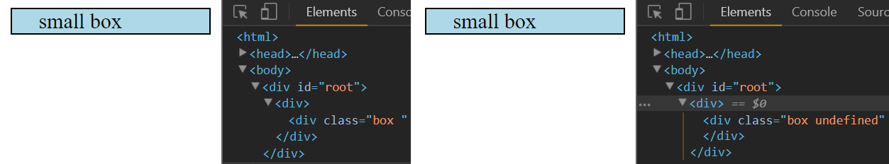

This is the fourth part of my notes on egghead.io's [The Beginner's Guide to ReactJS](https://egghead.io/courses/the-beginner-s-guide-to-reactjs).

### Style React Components

This section will explain how to style React components and how destructuring CSS classes can make our components more flexible.

Look at `className` and `style` in the code below.

```
const element = (
  <div>
    <div 
       className = "box box--small"
       style={{paddingLeft: 20}}
    >
        box
      </div>
    
  </div>
)
```

Notice the syntatic differences with vanilla CSS. We use `className` instead of `class`. It is camel-cased instead of kebab-cased. We cannot use `class` as a variable; it would be a syntax error. `paddingLeft` is written in the same style. 

`style` takes the value of 20 (type number) instead of the string `20px`. React converts it to pixels. **Note that values are also not vendor-prefixed.** Also, `style` takes an object instead of a string. We'll see how this is useful soon. 

With these simple CSS styles:

```
  .box {
    border: 1px solid black;
  }
  
  .box--large {
    width: 240px;
    height: 240px;
  }
  
  .box--medium {
    width: 120px;
    height: 120px;
  }
  
  .box--small {
    width: 60px;
    height: 60px;
  }
```

We get this result:


Here we make the React component `Box` that let's us add more props with the `props` parameter. It is similar to the box above except we add the background color property `lightblue` in the `Box` declaration in `element`.

```
function Box(props) {
  return (
    <div
      className = "box box--small"
      style = {{paddingLeft: 20}}
      {...props}
     />
  )
}

const element = (
  <div>
      <Box style={{backgroundColor: 'lightblue'}}>small box</Box>
  </div>
)
```

This is what is we see on the browser:


Due to the recursive nature of the spread operator `...`, the `style` in the element that is passed into the `prop` parameter overwrites the style in the `Box` declaration. So `element`'s `style` is the light blue background overwrites `Box`'s `style` of left padding.

#### Destructuring

Destructuring is a very help tool we can use to remedy this situation. Destructuring is when we unpack values from object properties or values from arrays.

Let's examine a solution with destructuring, step by step:

```
function Box({style, ...rest}) { // 1, then 2
  return (
    <div
      className = "box box--small"
      style = {{paddingLeft: 20, ...style}} // 4
      {...rest} // 3
     />
  )
}

const element = (
  <div>
      <Box style={{backgroundColor: 'lightblue'}}>small box</Box>
  </div>
)
```

1) We make a parameter called `style` in the `Box` declaration.

2) We create another parameter called `...rest` that will take the rest of the props.

3) Any styles are passed in as a continuations of the `style` in the `Box` declaration. This way no code gets overwritten.

4) Any other props that are not styles are added at the end.

We are extracting the property value `lightblue` and making sure it does not conflict with any other code.

We can achieve the same thing with `className`. 

```
function Box({style, className = "", ...rest}) { // 1, then 2
  return (
    <div
      className = {`box ${className}`}
```

We can add our `box--small` or `box--medium` when we make a `Box` in the `element` declaration. Notice how we gave `className` the default value `""`. This is because if we pass nothing, `className` shows up as `undefined` in the DOM since it wouldn't exist.



#### In Practice

Let's see how destructuring styles can be helpful in practice.

We want to make multiple boxes with different sizes and colors. We could apply the `className` and `style` color to each of them. Or, we could destructure the props out and use the destructuring pattern we used above.

```
function Box({style, size, className = "", ...rest}) { // 1, then 2
  const sizeClassName = size ? `box--${size}` : ''
  return (
    <div
      className = {`box ${className} ${sizeClassName}`}
      style = {{paddingLeft: 20, ...style}} // 4
      {...rest} // 3
     />
  )
}
```
In the code above, the code-author does not need to know the precise class names for the different box sizes. We use a string template so the user only types in the size they want, like "small." Destructuring can make our code more user-friendly if we want.

Our boxes look like this:

```
const element = (
  <div>
    <Box 
      size="small"
      style={{backgroundColor: 'lightblue'}}
    >
      small box
    </Box>
    <Box 
      size="medium"
      style={{backgroundColor: 'pink'}}
    >
      medium box
    </Box>
    <Box 
      size="large"
      style={{backgroundColor: 'orange'}}
    >
      large box
    </Box>
  </div>
)
```


Destructuring allows us to make flexible React components when styling.

#### TL;DR

1) To style a React component, use the `className` prop to assign CSS classes.

2) You can also use the style prop which has a CSS object as a value

3) Destructuring allows us to make flexible React components when styling.

#### Personal Thoughts on the Style Property

While the examples above illustrate how the style property works in React, it's considered best practice to keep HTML and CSS separate. I imagine we should try the same and avoid using the style property in React.