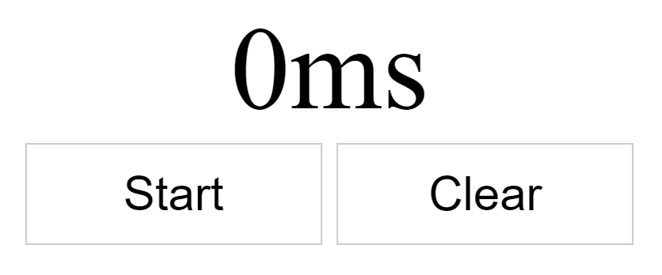
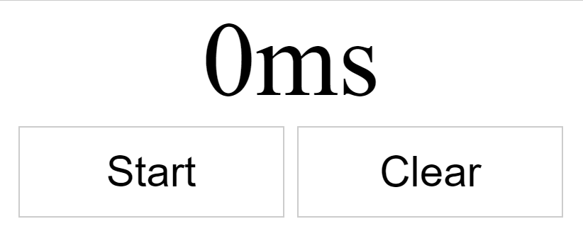

This is the fifth part of my notes on egghead.io's [The Beginner's Guide to ReactJS](https://egghead.io/courses/the-beginner-s-guide-to-reactjs).

### Use Component State with React

This section will show how to build a React app that maintains its own state.  First, we'll create a static UI, then take the dynamic parts and accept them as props. Then we'll refactor that to state and add event handlers to update the state.

#### Make the Static UI

The component `StopWatch` below creates a static UI with some styles. It returns a label and two buttons.

```
function StopWatch() {
  const buttonStyles = {
    border: '1px solid #ccc',
    background: '#fff',
    fontSize: '2em',
    padding: 15,
    margin: 5,
    width: 200,
  }
  return (
    <div style={{textAlign: 'center'}}>
      <label
        style={{fontSize: '5em', display: 'block'}}
      >
        0ms
      </label>
      <button style={buttonStyles}>Start</button>
      <button style={buttonStyles}>Clear</button>
    </div>
  )
}
const element = <StopWatch />
ReactDOM.render(
  element,
  document.getElementById('root'),
)
```



#### Make It Dynamic

Let's make the parts we want to be dynamic into props.

We add the prop `lapse` to the label and to the constant `element`. We add the prop `running` to the first button and to the constant `element`. If `running` is false we get "Start," and if it's true we get "Stop." `lapse` and `element` are initialized in the `element` constant.

```
  return (
    <div style={{textAlign: 'center'}}>
      <label
        style={{fontSize: '5em', display: 'block'}}
      >
        {lapse}ms
      </label>
      <button style={buttonStyles}>{running ? 'Stop' : 'Start'}</button>
      <button style={buttonStyles}>Clear</button>
    </div>
  )
}
const element = <StopWatch running={false} lapse={0} />
```

_Making a static UI first is a good way to start coding a dynamic application. It helps us understand what parts we want to take out and make dynamic._

#### Introduce `state`

Now we'll rewrite the component into a class.

 1) Move everything in the `StopWatch` function into the `StopWatch` class's `render` method.
 
 2) Delete the `StopWatch` function.
 
 Next we could assign `this.props` to our props in curly brackets `const {lapse, running}`, but we want the UI to dynamically maintain state. Instead we
 
 3) **introduce `state` in the class and assign it the props and initial values. `state` is a reserved word in React. This step is key to make our app dynamically maintain state!**
 
 4) Assign `this.state` to our props in curly brackets like this: `const {lapse, running} = this.state`
 
 5) Remove the `lapse` and `running` props in `element` identifier. We initialized these props in step 3.

```
class StopWatch extends React.Component {
  state = {lapse: 0, running: false}
  render() {
    const {lapse, running} = this.state
    const buttonStyles = {
      border: '1px solid #ccc',
      background: '#fff',
      fontSize: '2em',
      padding: 15,
      margin: 5,
      width: 200,
    }
    return (
      <div style={{textAlign: 'center'}}>
        <label
          style={{fontSize: '5em', display: 'block'}}
        >
          {lapse}ms
        </label>
        <button style={buttonStyles}>{running ? 'Stop' : 'Start'}</button>
        <button style={buttonStyles}>Clear</button>
      </div>
    )
  }
}

const element = <StopWatch />
```

Although our UI still hasn't changed in appearance, we've laid the groundwork for it to be dynamic. 

#### Make the UI Functional

Let's make the UI functional.

 1) Add `onClick` handlers to the Start and Stop buttons. Give it the value of `this.handleRunClick`.
 
 2) Make `handleRunClick` in the class. Assign an arrow function..
 
 3) The first thing `handleRunClick` returns is the constant `startTime`, which is `Date.now() - this.state.lapse`. This is the time in ms passed since 01.01.1970 minus 0.
 
 4) The second thing `handleRunClick` returns is the method `setInterval`. It updates lapse with `Date.now() - startTime`.
 
 `handleRunClick` updates `startTime` as often as possible with `setInterval`, which reassigns the value of `lapse` with `Date.now() - startTime`. The first time this runs, it will be `Date.now()` since `lapse` will be initialized as 0. When it runs the second time, it will be `Date.now()` minus the previous `startingTime`, so the time passed is reflected.
 
 5) In `handleRunClick`, update `state` with `this.setState({running: true})`. Now when the Start button is clicked, the clock will show "Stop" as the time runs.
 
 6) Add an `onClick` handler to to the Clear button. Give it the value of `this.handleClearClick`.
 
 7) Make `handleClearClick` in the class. Assign an arrow function.
 
 8) In `handleClearClick`, update `state` with `this.setState({lapse: 0, running: false})`. This resets our state to the initial values.
 
Let's check out the results below:

```
class StopWatch extends React.Component {
  state = {lapse: 0, running: false}
  handleRunClick = () => {
    const startTime = Date.now() - this.state.lapse
    setInterval(() => {
      this.setState({lapse: Date.now() - startTime})
    })
    this.setState({running: true})
  }
  handleClearClick = () => {
    this.setState({lapse: 0, running: false})
  }
  render() {
    const {lapse, running} = this.state
    const buttonStyles = {
      border: '1px solid #ccc',
      background: '#fff',
      fontSize: '2em',
      padding: 15,
      margin: 5,
      width: 200,
    }
    return (
      <div style={{textAlign: 'center'}}>
        <label
          style={{fontSize: '5em', display: 'block'}}
        >
          {lapse}ms
        </label>
        <button onClick={this.handleRunClick} style={buttonStyles}>{running ? 'Stop' : 'Start'}</button>
        <button onClick={this.handleClearClick} style={buttonStyles}>Clear</button>
      </div>
    )
  }
}
```



Uh oh! The timer starts, but the Start/Stop and Clear buttons don't do anything after that. In the code above, the Clear button will only work if the timer is paused, but the Start/Stop button cannot pause the timer.

We need to make those buttons' event handlers run conditionally off the current state. Let's start with `handleRunClick`.

1) Write `this.setState` and provide an updater function. Get the state by passing it in the function, then return the opposite of our current state. We are essentially toggling states.

2) Based off `state.running`, set the interval or pause the time. If it is running, clear the existing interval (remember that `running: true` shows 'Stop' on the first button). If not, set the interval.

3) Use `clearInterval` to stop a timer set by `setInterval`. `clearInterval` must take a variable, so give the `setInterval` identifier a handler. Assign `setInterval` to `this.timer`.

4) Put what was in the previous `handleRunClick` method into the `else` part of the statement.
 
```
handleRunClick = () => {
    this.setState(state => {
      if (state.running) {
        clearInterval(this.timer)
      } else {
        const startTime = Date.now() - this.state.lapse
        this.timer = setInterval(() => {
          this.setState({lapse: Date.now() - startTime})
        })
      }
      return {running: !state.running}
    })
```

To make `handleClearClick` always work, stop the timer with `clearInterval(this.timer)`. Like `handleRunClick`, this will let us clear the timer while the timer is running.

```
handleClearClick = () => {
  clearInterval(this.timer)
  this.setState({lapse: 0, running: false})
}
```


It works! This application has a memory leak which we will fix in the next lesson.

#### TL;DR

To make an application stateful, follow a process similar to the one we used to above.

1) Create a static UI.

2) Extract the parts that need to be dynamic into props.

3) Move the props into state, and then use the props that are initialized in state.

4) Add interactivity with event handlers. Modify the state with `this.setState`. 

5) If state depends on old state, then use an updater function that accepts state then returns the new state.

### Stop Memory Leaks with `componentWillUnmount`

If we remove the `StopWatch` component from the DOM while `StopWatch` is running, we get a serious memory leak. `setInterval` will continue to run even though nothing is displayed. We need to clear the interval.

To stop the memory leak, we'll use `componentWillUnmount`:

```
handleClearClick = () => {
  clearInterval(this.timer)
  this.setState({lapse: 0, running: false})
}
componenWillUnmount() {
  clearInterval(this.timer)
}
render() {
```

This is the explanation of `componentWillUnmount` in the [React docs](https://reactjs.org/docs/react-component.html):

> `componentWillUnmount()` is invoked immediately before a component is unmounted and destroyed. Perform any necessary cleanup in this method, such as invalidating timers, canceling network requests, or cleaning up any subscriptions that were created in `componentDidMount()`.

#### TL;DR

Use `componentWillUnmount()` when you need to remove things from the DOM to prevent memory leaks.