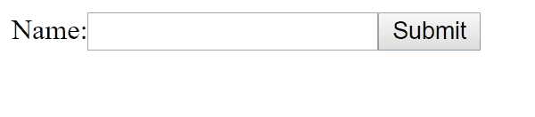

This is the seventh part of my notes on egghead.io's [The Beginner's Guide to ReactJS](https://egghead.io/courses/the-beginner-s-guide-to-reactjs).

### Make Basic Forms with React

#### Preventing Default Behavior

Let's start with a basic input and submit button in a form element:

```
class NameForm extends React.Component {
  render() {
    return (
    <form>
      <label>
        Name:
        <input type="text" />
        <button type="submit">Submit</button>
      </label>
    </form>
    )
  }
}

ReactDOM.render(
  <NameForm />,
  document.getElementById('root'),
)
```


By default, submit refreshes the page. To fix this, add the `onSubmit` event handler to `form`. Then assign `this.handleSubmit` to `onSubmit`. Next, add the property `handleSubmit` in the class body (this is a public class field we discussed previously) and assign it an arrow function that takes `event` as an argument and returns `event.preventDefault()`.

```
class NameForm extends React.Component {
  handleSubmit = event => {
    event.preventDefault()
  }
  render() {
    return (
    <form onSubmit={this.handleSubmit}>
      <label>
        Name:
        <input type="text" />
        <button type="submit">Submit</button>
      </label>
    </form>
    )
  }
}
```


Now the page doesn't refresh anymore when the submit button is pressed.

#### Getting the Input Value

There are three ways to get the input value.

1) The **target event property**

We can use `event.target` to return the element that triggered the event. By assigning `event.target` to a property in an object and logging it to the console, we can see all the properties of `form`.

Our code looks like this:

```
  handleSubmit = event => {
    event.preventDefault()
    console.log({target: event.target})
  }
```

And we can find in the console the value of the input.


Assigning `event.target` to a property in an object literal and logging it in React will log the data to the console in a JSON style format, similar to `JSON.stringify` or `console.dir(...)`.

In the console we click on `{target: form}`, then `target:form`, then `0:input`, and finally on the `(...)` value under `value` to see the string `"Richard"` or whatever is submitted in the form.

With this knowledge, we could get the value with **`event.target[0].value`**.

2) The second way is by adding the `name` prop to the `input`.

Like this: `<input type="text" name="username"/>`

We can then find the `value` of the input in the console.


Click on `{target: form}`, then `target: form`, then `elements`, `username`, and finally on the `(...)` value under `value`.

We could get the input similar to number 2 with `event.target.elements.username.value`.

Logging this to the console:

```
    console.log({target: event.target})
    console.log(event.target[0].value)
    console.log(event.target.elements.username.value)
```

And submitting `Richard` would show this:


3) The last way is with React's `ref` prop.

Adding a `ref` to the `input` like this:

```
<input type="text" name="username" ref={node => (this.inputNode = node)}/>
```

Can log the value to the console like this:

```
console.log(this.inputNode.value)
```

It's a good practice not to assign arrow functions to refs since it recreates the function on each rerender and for [other reasons](https://stackoverflow.com/questions/36677733/why-shouldnt-jsx-props-use-arrow-functions-or-bind). We could rewrite the code like this: 

```
  setRef = node => {
    this.inputNode = node
  }
  render() {
    return (
    <form onSubmit={this.handleSubmit}>
      <label>
        Name:
        <input type="text" name="username" ref={this.setRef}/>
        <button type="submit">Submit</button>
      </label>
    </form>
```

#### TL;DR

There are three ways to get the input from a React form.

1) With the target event property.

2) With the `name` prop.

3) With `refs`.

Refs are nice because they makes things more explicit, but the name attributes can be helpful when there is a big form and keeping track of many refs would be tedious.

### Make Dynamic Forms with React

This section will discuss how to use the `onChange` prop on an input to do dynamic and custom validation of a form as the user makes changes to the input.

Below we have a form that renders `Name` label, input, and submit button. One of two error messages can appear after pressing the submit button. The first is if the input is less than three characters and the second is if the input does not contain the "s" character. If there is no error the we alert the user with success.



This experience is somewhat incovenient for the user; it would better if the error messages were rendered as the user was typing and the submit button was only clickable if the input is acceptable. Let's try to code that.

First, let's examine the code in the current static form. It looks like this:

```
class NameForm extends React.Component {
  handleSubmit = event => {
    event.preventDefault()
    const value = 
      event.target.elements.username.value
    const error = this.props.getErrorMessage(
      value,
    )
    if (error) {
      alert(`error: ${error}`)
    } else {
      alert(`success: ${value}`)
    }
  }

  render() {
    return (
      <form onSubmit={this.handleSubmit}>
        <label>
          Name:
          <input type="text" name="username" />
        </label>
        <button type="submit">Submit</button>
      </form>
    )
  }
}

ReactDOM.render(
  <NameForm
    getErrorMessage={value => {
      if (value.length < 3) {
        return `Value must be at least 3 characters, but is only 2`
      }
      if (!value.includes('s')) {
        return `Value does not include "s" but it should!`
      }
      return null
    }}
  />,
  document.getElementById('root'),
)
```

This code renders a form with a handler when the submit button is clicked. The handler prevents the default behavior of submit, gets the value of the input, gets the error message from the `getErrorMessage` prop on the `NameForm` component, and either alerts the error or a success with the input value.

Validation of the input is done by the `getErrorMessage` prop on the `NameForm` component. This is done by assigning an arrow function takes the input value as an argument and checks the input with if statements.

#### Managing State with the `onChange` prop

We must first introduce state to make it dynamic. Add state after at the beginning of the class body like this:

```
  state = {error: null}
```

Add the onChange prop to the input and assign it `this.handleChange` like this:

```
  <input type="text" onChange={this.handleChange} name="username" />
```

The `handleChange` method gets the value of the input and sets `error` state property with the `getErrorMessage` prop. The code looks like this:

```
    handleChange = (event) => {
      const {value} = event.target
      this.setState({
        error: this.props.getErrorMessage(value)
      })
    }
```
Get our error (our state) at the beginning of the render method like this:

```
  const {error} = this.state
```

Disable the button by default by assigning it a Boolean function with `error` as the argument:

