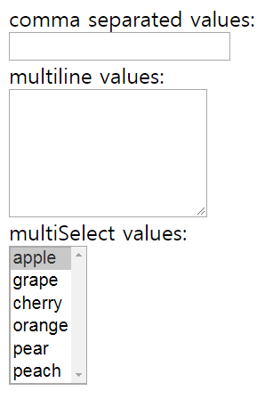
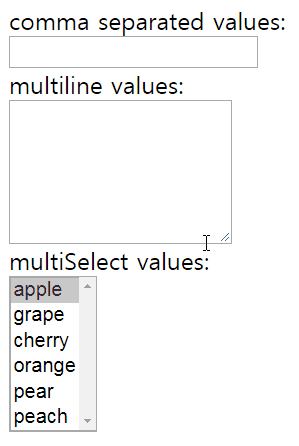

This is the eigth part of my notes on egghead.io's [The Beginner's Guide to ReactJS](https://egghead.io/courses/the-beginner-s-guide-to-reactjs). It will cover two videos, [Controlling Form Values with React](https://egghead.io/lessons/egghead-controlling-form-values-with-react) and [Use the key prop when Rendering a List with React](https://egghead.io/lessons/egghead-use-the-key-prop-when-rendering-a-list-with-react).

### Controlling Form Values with React

This section will discuss controlling the value for the `input`, `textarea`, and `select` elements. We'll see how to manage the state ourselves while still allowing the user to update the values themselves. A component that does this is called a "controlled component."

Below we have a form with an `input`, `textarea`, and `select` elements.



Each element has its own `onChange` prop with a respective `onChange` handler. The code for everything looks like this:

```
class MyFancyForm extends React.Component {
  static availableOptions = [
    'apple',
    'grape',
    'cherry',
    'orange',
    'pear',
    'peach',
  ]
  handleCommaSeparatedChange = event => {
    console.log('handleCommaSeparatedChanged')
  }
  handleMultilineChange = event => {
    console.log('handleMultilineChanged')
  }
  handleMultiSelectChange = event => {
    console.log('handleMultiSelectChanged')
  }
  render() {
    return (
      <form>
        <div>
          <label>
            comma separated values:
            <br />
            <input 
              type="text"
              onChange={
                this.handleCommaSeparatedChange
              }
            />
          </label>
        </div>
        <div>
          <label>
            multiline values:
            <br />
            <textarea
              rows={
                MyFancyForm.availableOptions
                  .length
              }
              onChange={
                this.handleMultilineChange
              }
            />
          </label>
        </div>
        <div>
          <label>
            multiSelect values:
            <br />
            <select
              multiple
              size={
                MyFancyForm.availableOptions
                  .length
              }
              onChange={
                this.handleMultiSelectChange
              }
            >
              {MyFancyForm.availableOptions.map(
                optionValue => (
                  <option
                    key={optionValue}
                    value={optionValue}
                  >
                    {optionValue}
                  </option>
                ),
              )}
            </select>
          </label>
        </div>
      </form>
    )
  }
}

ReactDOM.render(
  <MyFancyForm/>,
  document.getElementById('root'),
)
```

Our goal will be to synchronize the state of all the forms. In other words, typing "apple" in the input would make that word appear in the `textarea` and selected in the `select` element. Typing or selecting something in another element would likewise affect the other elements similarly.

#### Updating State and Rerendering Input

The first step is to introduce state in the class body:

```
state = {multiline: '', commaSeparated: ''}
```

Notice we assign an empty string to each property. Next, add the value `multiline` to the `input` and the value `commaSeparated` to the `textarea`. For example: `value={multiline}`.

Then pull `mutiline` and `commaSeparated` from state at the beginning of the render method like this: `const {commaSeparated, multiline} = this.state`.

If you try to type something in the `input` or `textarea` at this stage nothing will be entered. This is because it is impossible for the user to update the value of an `input` or `textarea` if the element has a `value` prop on it.

We can let user type input and still control updating the input ourselves with the `onChange` prop and the respective handler. Let's start with the handler `handleCommaSeparatedChange` for `input`'s `onChange` prop.

If we log the `event.target.value` in that handler, we'll see everything we type in the console but the value of the input does not update.


We can update the value with `setState` in the handler:

```
 handleCommaSeparatedChange = event => {
    this.setState({
      commaSeparated: event.target.value
    })
  }
```



Let's re-examine what's happening:

1) Every time the change event happens, we update the `commaSeparated` state.

2) Whenever `setState` is called, a rerender happens.

3) We put the new state in the input value on each rerender.

This sort of makes an illusion that we are typing normally but we are actually updating the state and rerendering the input value manually and dynamically.

#### Synchronizing States

The next step is to update the `multiline` state based on the `commaSeparated` state.