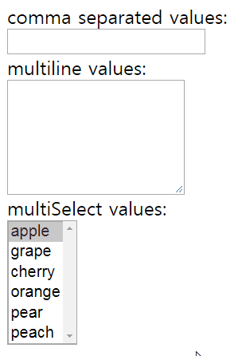
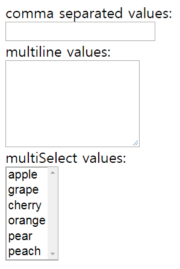
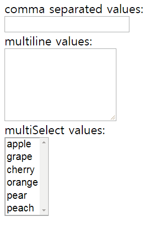
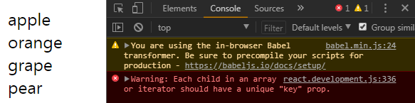
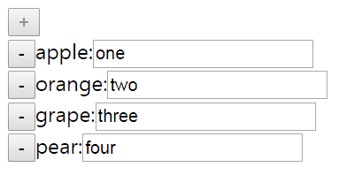
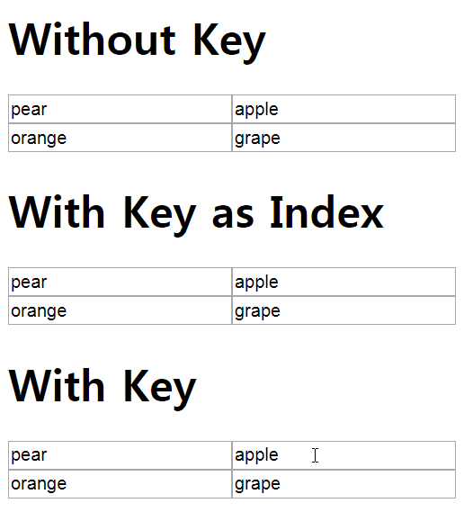

This is the eigth part of my notes on egghead.io's [The Beginner's Guide to ReactJS](https://egghead.io/courses/the-beginner-s-guide-to-reactjs). It will cover two videos, [Controlling Form Values with React](https://egghead.io/lessons/egghead-controlling-form-values-with-react) and [Use the key prop when Rendering a List with React](https://egghead.io/lessons/egghead-use-the-key-prop-when-rendering-a-list-with-react).

### Controlling Form Values with React

This section will discuss controlling the value for the `input`, `textarea`, and `select` elements. We'll see how to manage the state ourselves while still allowing the user to update the values themselves. A component that does this is called a "controlled component."

Below we have a form with an `input`, `textarea`, and `select` elements.


Each element has its own `onChange` prop with a respective `onChange` handler. The code for everything looks like this:

```javascript
class MyFancyForm extends React.Component {
  static availableOptions = [
    'apple',
    'grape',
    'cherry',
    'orange',
    'pear',
    'peach',
  ]
  handleCommaSeparatedChange = event => {
    console.log('handleCommaSeparatedChanged')
  }
  handleMultilineChange = event => {
    console.log('handleMultilineChanged')
  }
  handleMultiSelectChange = event => {
    console.log('handleMultiSelectChanged')
  }
  render() {
    return (
      <form>
        <div>
          <label>
            comma separated values:
            <br />
            <input 
              type="text"
              onChange={
                this.handleCommaSeparatedChange
              }
            />
          </label>
        </div>
        <div>
          <label>
            multiline values:
            <br />
            <textarea
              rows={
                MyFancyForm.availableOptions
                  .length
              }
              onChange={
                this.handleMultilineChange
              }
            />
          </label>
        </div>
        <div>
          <label>
            multiSelect values:
            <br />
            <select
              multiple
              size={
                MyFancyForm.availableOptions
                  .length
              }
              onChange={
                this.handleMultiSelectChange
              }
            >
              {MyFancyForm.availableOptions.map(
                optionValue => (
                  <option
                    key={optionValue}
                    value={optionValue}
                  >
                    {optionValue}
                  </option>
                ),
              )}
            </select>
          </label>
        </div>
      </form>
    )
  }
}

ReactDOM.render(
  <MyFancyForm/>,
  document.getElementById('root'),
)
```

Our goal will be to synchronize the state of all the forms. In other words, typing "apple" in the input would make that word appear in the `textarea` and selected in the `select` element. Typing or selecting something in another element would likewise affect the other elements similarly.

#### Updating State and Rerendering Input

The first step is to introduce state in the class body:

```javascript
  state = {multiline: '', commaSeparated: ''}
```

Notice we assign an empty string to each property. Next, add the value `multiline` to the `input` and the value `commaSeparated` to the `textarea`. For example: `value={multiline}`.

Then pull `mutiline` and `commaSeparated` from state at the beginning of the render method like this: `const {commaSeparated, multiline} = this.state`.

If you try to type something in the `input` or `textarea` at this stage nothing will be entered. This is because it is impossible for the user to update the value of an `input` or `textarea` if the element has a `value` prop on it.

We can let user type input and still control updating the input ourselves with the `onChange` prop and the respective handler. Let's start with the handler `handleCommaSeparatedChange` for `input`'s `onChange` prop.

If we log the `event.target.value` in that handler, we'll see everything we type in the console but the value of the input does not update.


We can update the value with `setState` in the handler:

```javascript
 handleCommaSeparatedChange = event => {
    this.setState({
      commaSeparated: event.target.value
    })
  }
```


Let's re-examine what's happening:

1) Every time the change event happens, we update the `commaSeparated` state.

2) Whenever `setState` is called, a rerender happens.

3) We put the new state in the input value on each rerender.

This sort of makes an illusion that we are typing normally but we are actually updating the state and rerendering the input value manually and dynamically.

#### Synchronizing States

The next step is to update the `multiline` state based on the `commaSeparated` state.

We must add some things to `handleCommaSeparatedChange` to accomplish this.

First, we'll pull out `value` from `event.target` and assign it to a `const`. Then we'll add the `multiline` state property to the current `setState` method. The `multiline` assignment looks like this: 

```javascript
  multiline: value
    .split(',')
    .map(v => v.trim())
    .filter(Boolean)
    .join('\n')
```

This code splits typed in the `input` with a comma as the delimiter, trims each value of whitespace, filters out any empty strings, and then joins them together with a new line.  The result is that a list of things we've typed appears in the `textarea`.

Here is the updated code:

```javascript
  handleCommaSeparatedChange = event => {
    const { value } = event.target
    this.setState({
      commaSeparated: value,
      multiline: value
        .split(',')
        .map(v => v.trim())
        .filter(Boolean)
        .join('\n')
    })
  }
```



If we type in the textarea nothing happens since the current handler for that doesn't update anything. Making `handleMultilineChange` update state will be the next step.

The process is similar for making `handleCommaSeparatedChange`, except we invert `.split('\n')` and `.join(',')`.

```javascript
  handleMultilineChange = event => {
    const { value } = event.target
    this.setState({
      multiline: value,
      commaSeparated: value
        .split('\n')
        .map(v => v.trim())
        .filter(Boolean)
        .join(',')
    })
  }
```

Now the `textarea` also updates the `input`.


The last element to wire up is the `select` element.

A multiple `select` element is unique in that it takes an array for its value. Add the `multiple value` prop and assign it `multiSelect` to the `select` element like this: `multiple value={multiSelect}`. Also assign it to the `const`'s extracted from `state` at the beginning of the render method and initialize it in state by assigning it an empty array.

Let's update `handleCommaSeparatedChange` to update `multiSelect` state. We need an array of the values we've typed to match up with the values in the `select` element, so we'll add this to the handler:

```javascript
  const allVals = value
    .split(',')
    .map(v => v.trim())
    .filter(Boolean)
```

We can refactor updating the multiline state in the same handler with:


```javascript
  multiline: allVals
    .join('\n'),
```

And then finally update `multiSelect` state by matching only the values that are in `availableOptions`.

```javascript
  multiSelect: allVals.filter(v => MyFancyForm.availableOptions.includes(v))
```



We'll do something similar for `handleMultilineChange` since it doesn't update `multiSelect` state yet.

The code is the same, except we split the value by a newline when getting an array of the values. The `textarea` updates all states now.

Finally we'll have to make `handleMultiSelectChange` update states.

If we log `{target: event.target}` in the handler and click on an option, we can see the property `selectedOptions`. If we log `event.target.selectedOptions` and click on an option, we can see the `option` logged to the console. Since `handleMultiSelectChange` doesn't update state yet the value of the empty array is rerendered with nothing and nothing is selected when we click on an option in the `select` element.

To update `multiSelect` state, get all the option values first:

```javascript
  const allVals = Array.from(event.target.selectedOptions).map(
    o => o.value,
  ))
```

Since we cannot map an HTML node list, we turn it into an array with `Array.from(...)`.

Update the `state` like this in the handler:

```javascript
  this.setState({
    multiSelect: allVals,
    multiline: allVals.join('\n'),
    commaSeparated: allVals.join(',')
  })
```

Now we can select options in the `select` element and all the `input`, `textarea`, and `select` handlers are synchronized to update each others' elements' state.



#### TL;DR

To control the input values,

1) Specify a `value` on the `input` and `textarea` props. Note in normal HTML the children of the `textarea` element would be the value. On a multiple select the value is an array.

2) Use an `onChange` prop for each element to the event.

3) Write a handler for each `onChange` prop to get the value from the event.

4) Update the state with the `setState` method, which in turn will rerender the component with the new state assigned to the value.

### Use the key prop when Rendering a List with React

This section will show how to use the `key` prop correctly when rendering a list in React.

Our starting code looks like this:

```javascript
class App extends React.Component {
  static allItems = [
    {id: 'a', value: 'apple'},
    {id: 'o', value: 'orange'},
    {id: 'g', value: 'grape'},
    {id: 'p', value: 'pear'},
  ]
  render() {
    return (
      <div>
        {App.allItems.map(item => (
          <div>{item.value}</div>
        ))}
      </div>
    )
  }
}
```

It's a class with an array and a render method that maps out  each value of the array into its own div. The result is a list.

However, we get the error `Warning: Each child in an array or iterator should have a unique "key" prop.` in the console in the developer tools.



Whenever a rerender occurs, React needs to know what items are added or removed from one array to another. In our example, React wants to know what items are added or removed when we build the list with the JSX map expression in our render method.

The `key` prop in React serves as an id for a value in an array.

We can use the `id` property for each item in the `allItems` array. Now the error doesn't appear in the console anymore and React can keep track of each node.

#### Using the key prop when using inputs

Using the `key` prop isn't that important in the example above, so let's examine a scenario where using `key` properly matters.

This code below includes the `allItems` array except it adds state and event handlers to add or remove items from the state. It also renders an add items button. When the add button is clicked a remove button, state value, and an empty input is displayed for each item in the state.

```javascript
class App extends React.Component {
  static allItems = [
    {id: 'a', value: 'apple'},
    {id: 'o', value: 'orange'},
    {id: 'g', value: 'grape'},
    {id: 'p', value: 'pear'},
  ]
  state = {items: []}
  addItem = () => {
    this.setState(({items}) => ({
      items: [
        ...items,
        App.allItems.find(
          i => !items.includes(i),
        ),
      ],
    }))
  }
  removeItem = item => {
    this.setState(({items}) => ({
      items: items.filter(i => i !== item),
    }))
  }
  render() {
    const {items} = this.state
    return (
      <div>
        <button
          disabled={
            items.length >= App.allItems.length
          }
          onClick={this.addItem}
        >
          +
        </button>
        {items.map((i, index) => (
          <div>
            <button
              onClick={() => this.removeItem(i)}
            >
              -
            </button>
            {i.value}:
            <input />
          </div>
        ))}
      </div>
    )
  }
}
```

Since React can't keep track of each item without the `key` prop, inputs entered may not remain in their original inputs when items are moved.



Without the `key` prop, inputs are not properly associated with items. This is why it is good to have an id for each item in your data.

Here we use the item id for the key prop like this: `key={i.id}`


#### Using the key prop when using element focus

We can also observe why keys are important with element focus. In the example below, there are three lists with randomly shuffled inputs. The first has no key, the second uses the index as the key, and the last one uses a proper id for the key.

If we click on an input in the first two, we'll see the focus does not remain on the item we've clicked. It changes in the second one because the index of an array is not a proper identifier. It only works in the last example.



Since this example is for illustrating the importance of the `key` prop I won't go into the code. If you want to look at it you can find it on [Kent C. Dodd's GitHub repository](https://github.com/eggheadio-projects/the-beginner-s-guide-to-reactjs/blob/master/16-rendering-an-array-in-react/index.html).

#### TL;DR

Use the `key` prop when rendering a list in React. It's good to use an id for items you're rendering; the index of an array is not a proper identifier.