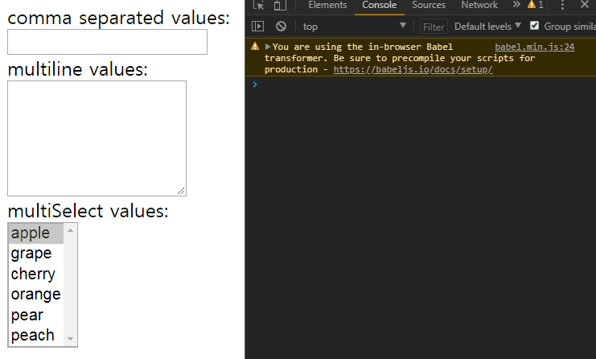

This is the eigth part of my notes on egghead.io's [The Beginner's Guide to ReactJS](https://egghead.io/courses/the-beginner-s-guide-to-reactjs). It will cover two videos, [Controlling Form Values with React](https://egghead.io/lessons/egghead-controlling-form-values-with-react) and [Use the key prop when Rendering a List with React](https://egghead.io/lessons/egghead-use-the-key-prop-when-rendering-a-list-with-react).

### Controlling Form Values with React

This section will discuss controlling the value for the `input`, `textarea`, and `select` elements. We'll see how to manage the state ourselves while still allowing the user to update the values themselves. A component that does this is called a "controlled component."

Below we have a form with an `input`, `textarea`, and `select` elements.


Each element has its own `onChange` prop with a respective `onChange` handler. The code for everything looks like this:

```
class MyFancyForm extends React.Component {
  static availableOptions = [
    'apple',
    'grape',
    'cherry',
    'orange',
    'pear',
    'peach',
  ]
  handleCommaSeparatedChange = event => {
    console.log('handleCommaSeparatedChanged')
  }
  handleMultilineChange = event => {
    console.log('handleMultilineChanged')
  }
  handleMultiSelectChange = event => {
    console.log('handleMultiSelectChanged')
  }
  render() {
    return (
      <form>
        <div>
          <label>
            comma separated values:
            <br />
            <input 
              type="text"
              onChange={
                this.handleCommaSeparatedChange
              }
            />
          </label>
        </div>
        <div>
          <label>
            multiline values:
            <br />
            <textarea
              rows={
                MyFancyForm.availableOptions
                  .length
              }
              onChange={
                this.handleMultilineChange
              }
            />
          </label>
        </div>
        <div>
          <label>
            multiSelect values:
            <br />
            <select
              multiple
              size={
                MyFancyForm.availableOptions
                  .length
              }
              onChange={
                this.handleMultiSelectChange
              }
            >
              {MyFancyForm.availableOptions.map(
                optionValue => (
                  <option
                    key={optionValue}
                    value={optionValue}
                  >
                    {optionValue}
                  </option>
                ),
              )}
            </select>
          </label>
        </div>
      </form>
    )
  }
}

ReactDOM.render(
  <MyFancyForm/>,
  document.getElementById('root'),
)
```

Our goal will be to synchronize the state of all the forms. In other words, typing "apple" in the input would make that word appear in the `textarea` and selected in the `select` element. Typing or selecting something in another element would likewise affect the other elements similarly.

#### Updating State and Rerendering Input

The first step is to introduce state in the class body:

```
state = {multiline: '', commaSeparated: ''}
```

Notice we assign an empty string to each property. Next, add the value `multiline` to the `input` and the value `commaSeparated` to the `textarea`. For example: `value={multiline}`.

Then pull `mutiline` and `commaSeparated` from state at the beginning of the render method like this: `const {commaSeparated, multiline} = this.state`.

If you try to type something in the `input` or `textarea` at this stage nothing will be entered. This is because it is impossible for the user to update the value of an `input` or `textarea` if the element has a `value` prop on it.

We can let user type input and still control updating the input ourselves with the `onChange` prop and the respective handler. Let's start with the handler `handleCommaSeparatedChange` for `input`'s `onChange` prop.

If we log the `event.target.value` in that handler, we'll see everything we type in the console but the value of the input does not update.



We can update the value with `setState` in the handler:

```
 handleCommaSeparatedChange = event => {
    this.setState({
      commaSeparated: event.target.value
    })
  }
```


Let's re-examine what's happening:

1) Every time the change event happens, we update the `commaSeparated` state.

2) Whenever `setState` is called, a rerender happens.

3) We put the new state in the input value on each rerender.

This sort of makes an illusion that we are typing normally but we are actually updating the state and rerendering the input value manually and dynamically.

#### Synchronizing States

The next step is to update the `multiline` state based on the `commaSeparated` state.

We must add some things to `handleCommaSeparatedChange` to accomplish this.

First, we'll pull out `value` from `event.target` and assign it to a `const`. Then we'll add the `multiline` state property to the current `setState` method. The `multiline` assignment looks like this: 

```
  multiline: value
    .split(',')
    .map(v => v.trim())
    .filter(Boolean)
    .join('\n')
```

This code splits typed in the `input` with a comma as the delimiter, trims each value of whitespace, filters out any empty strings, and then joins them together with a new line.  The result is that a list of things we've typed appears in the `textarea`.

Here is the updated code:

```
  handleCommaSeparatedChange = event => {
    const { value } = event.target
    this.setState({
      commaSeparated: value,
      multiline: value
        .split(',')
        .map(v => v.trim())
        .filter(Boolean)
        .join('\n')
    })
  }
```


If we type in the textarea nothing happens since the current handler for that doesn't update anything. Making `handleMultilineChange` update state will be the next step.

The process is similar for making `handleCommaSeparatedChange`, except we invert `.split('\n')` and `.join(',')`.

```
  handleMultilineChange = event => {
    const { value } = event.target
    this.setState({
      multiline: value,
      commaSeparated: value
        .split('\n')
        .map(v => v.trim())
        .filter(Boolean)
        .join(',')
    })
  }
```

Now the `textarea` also updates the `input`.


The final step is to setup the handler for the `select`.

A multiple `select` element is unique in that it takes an array for its value. Add the `multiple value` prop and assign it `multiSelect` to the `select` element like this: `multiple value={multiSelect}`. Also assign it to the `const`'s extracted from `state` at the beginning of the render method and initialize it in state by assigning it an empty array.

Let's update `handleCommaSeparatedChange` to update `multiSelect` state. We need an array of the values we've typed to match up with the values in the `select` element, so we'll add this to the handler:

```
  const allVals = value
    .split(',')
    .map(v => v.trim())
    .filter(Boolean)
```

We can refactor updating the multiline state in the same handler with:


```
  multiline: allVals
    .join('\n'),
```

And then finally update `multiSelect` state by matching only the values that are in `availableOptions`.

```
  multiSelect: allVals.filter(v => MyFancyForm.availableOptions.includes(v))
```


We'll do something similar for `handleMultilineChange` since it doesn't update `multiSelect` state yet.

The code is the same, except we split the value by a newline when getting an array of the values. The `textarea` updates all states now.

Finally we'll have to make `handleMultiSelectChange` update states.

If we log `{target: event.target}` in the handler and click on an option, we can see the property `selectedOptions`. If we log `event.target.selectedOptions` and click on an option, we can see the `option` logged to the console. Since `handleMultiSelectChange` doesn't update state yet the value of the empty array is rerendered with nothing and nothing is selected when we click on an option in the `select` element.

To update `multiSelect` state, get all the option values first:

```
  const allVals = Array.from(event.target.selectedOptions).map(
    o => o.value,
  ))
```

Since we cannot map an HTML node list, we turn it into an array with `Array.from(...)`.

Update the `state` like this in the handler:

```
  this.setState({
    multiSelect: allVals,
    multiline: allVals.join('\n'),
    commaSeparated: allVals.join(',')
  })
```

Now we can select options in the `select` element and all the `input`, `textarea`, and `select` handlers are synchronized to update each others' elements' state.


#### TL;DR

To control the input values,

1) Specify a `value` on the `input` and `textarea` props. Note in normal HTML the children of the `textarea` element would be the value. On a multiple select the value is an array.

2) Use an `onChange` prop for each element to the event.

3) Write a handler for each `onChange` prop to get the value from the event.

4) Update the state with the `setState` method, which in turn will rerender the component with the new state assigned to the value.