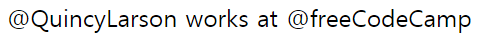
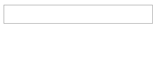

This is the final part of my notes on egghead.io's [The Beginner's Guide to ReactJS](https://egghead.io/courses/the-beginner-s-guide-to-reactjs). It will cover two videos, [Make HTTP Requests with React](https://egghead.io/lessons/egghead-make-http-requests-with-react) and [Build and Deploy a React Application](https://egghead.io/lessons/egghead-build-and-deploy-a-react-application).

### Make HTTP Requests with React

Below we have class `UserCompany` that renders the company state or the string "Unknown." The state is initialized as undefined.

We'll render an element that interpolates the `username` const and renders the `UserCompany` class.

```javascript
class UserCompany extends React.Component {
  state = {company: undefined}
  render() {
    return this.state.company || 'Unknown'
  }
}
const username = 'CountChocula1234'
const element = (
  <div>
    <div>
      {`@${username} works at `}
      <UserCompany username={username} />
    </div>
  </div>
)
```

#### Make a HTTP Request in componentDidMount

We will write the HTTP request in the `componentDidMount` lifecycle method with the [axios library](https://github.com/axios/axios). Axios is a promise based HTTP library for the browser and Node.js.  

Import the library with the script at the top of the code:

```javascript
<script src="https://unpkg.com/axios@0.16.2/dist/axios.min.js"></script>
```

The request will look like this:

```javascript
  componentDidMount() {
    axios({
      url: 'https://api.github.com/graphql',
      method: 'post',
      data: {
        query: `{
          user(login: "${this.props.username}") {
            company
          }
        }`,
      },
      headers: {Authorization: `bearer TOKEN`},
    })
  }
```

We make the request with `axios`, which has a couple of options. `url` is the link for the API. We use a `post` HTTP type request. We write our query in `data`. It looks like an object, but it's a graphQL query. It fetches the company.

We enter the token under `headers`. The token goes where `TOKEN` is written; I decided not to post an actual token here for privacy reasons. You can get the token from the developer settings in GitHub. Name the token "user Company" and check the box for "read:user." Generate the token.

#### Update the State

Once that request finishes, update the state inside of a `then` method:

```javascript
headers: {Authorization: `bearer TOKEN`},
    }).then(response => {
      this.setState({company: responses.data.data.user.company,})
    })
```

This renders something like this:



#### Loaded

Before the name and company renders, we might see "Unknown" very briefly. Since the data is loading rather than unknown, let's reflect that in the app.

Add `loaded: false` to state. 

Update `loaded` to true in the `then` setState method:

```javascript
  this.setState({
    loaded: true,
    company: responses.data.data.user.company,
  })
```

And finally rewrite the render method like this:

```javascript
  render() {
    return this.state.loaded ? this.state.company || 'Unknown' : '...'
  }
```

Now the app will show "..." while if fetches data and "Unknown" when the HTTPs request fetches nothing. 

#### Error Message

If you want to render an error message, you can add an error handler after the `.then` method:

```javascript
      .then(response => {
      this.setState({
        loaded: true,
        company: response.data.data.user.company,
      })
    }, error => {
      this.setState({
        error,
        loading: true
      })
    })
```

And then modify the ternary expression in the render method to render the error message:

```javascript
return this.state.loaded ? 
       this.state.error ? 
       'ERROR (You probably need to add your own token)' 
       : this.state.company || 'Unknown' : '...'
```

#### TL;DR

To make an asynchronous request with React, 

1) Use the lifecycle method `componentDidMount`

2) Use a library like [axios](https://www.npmjs.com/package/axios) to make a request

3) When that request resolves, use `setState` 

4) Render the state in the render method

For an interactive demo of the app, I recommend checking out Kent C. Dodd's [repository](https://github.com/eggheadio-projects/the-beginner-s-guide-to-reactjs/blob/master/17-make-http-requests-with-react/index.html). He changed the code so the user can type in a username and their company will be rendered. You just need to add your own token.



### Build and Deploy a React Application

The last video covers how to deploy a React application with [codesandbox.io](https://codesandbox.io/). Since there isn't any code to cover, I think watching Kent C. Dodd's [video](https://egghead.io/lessons/egghead-build-and-deploy-a-react-application) is better than reading notes. I'll just cover the main points.

* Codesandbox is an online web application editor. 

* You can code and edit a React app in Codesandbox and the changes will be made live. 

* You can make a link for your app and see the full app in the web browser (outside of Codesandbox's editor).

* You can change between code, browser, and split views at the top of Codesandbox

* You can see your files and dependencies on the left

* This works by importing React from "react" and { render } from "react-dom" in the index file. You can then use JSX and render your code to the root element.

* If we want to deploy your app, download the app in a zip file and run it in your editor.

* By running `npm install` and `npm run start` in the command line, you can run the code locally.

* You can create a production build with `npm run build`

* You can deploy upload and deploy your app to [Netlify](https://www.netlify.com/) with the build folder created from the last step
