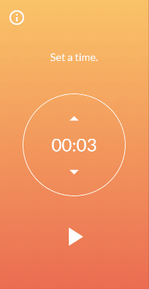
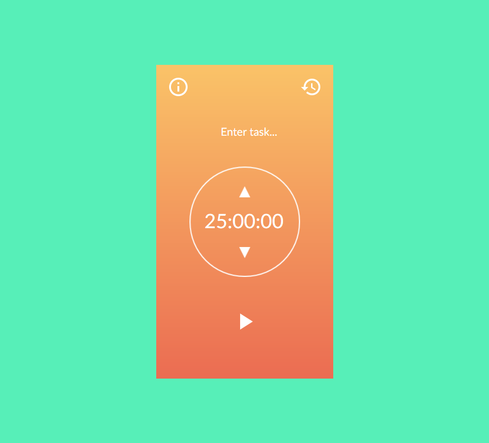
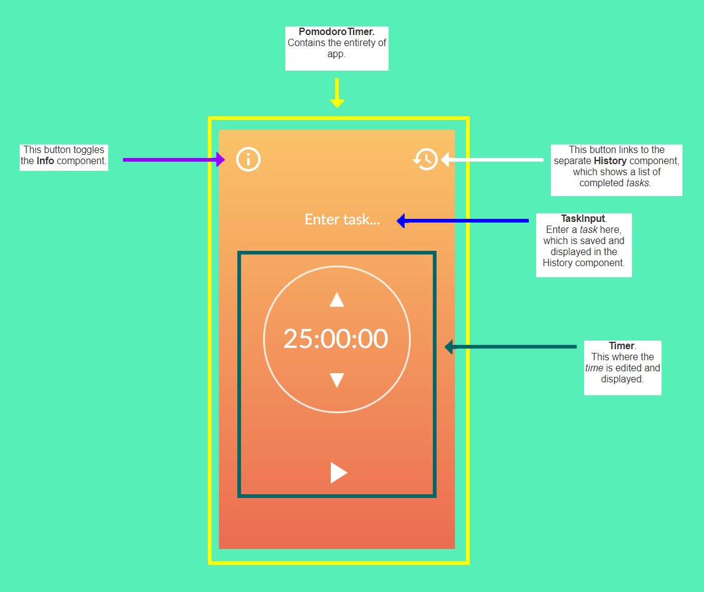

## Lessons learned from my first React app



I'm going to share things I wish I knew, wish I did, or was glad I did when I made my first React app.It's a Pomodoro Clock, or a productivity timer. I built it for a [freeCodeCamp project](https://learn.freecodecamp.org/front-end-libraries/front-end-libraries-projects/build-a-pomodoro-clock/) and to practice the React I learned for a [Chingu](https://chingu.io/) cohort.

You can check it out live [here](https://ellereeeee-pomodoro-clock.netlify.com/) and the code [here](https://github.com/ellereeeee/pomodoro-clock).

Hopefully I can help some React newbies.

### Read the React docs

If you're just starting to learn React, start with the [official docs](https://reactjs.org/docs/hello-world.html). As far as docs go, the React ones are easy to understand and provide lots of examples.

Don't do what I did and start with a React tutorial. I started with egghead.io's [The Beginner's Guide to React](https://egghead.io/courses/the-beginner-s-guide-to-react) ("_Beginner's_" is a misnomer in my opinion) and it was rough. To be fair, I've heard egghead.io is meant for more experienced developers looking to get up to speed with a new framework.


I definitely learned a lot, but there was a lot of pausing videos, going back 10 seconds to hear an explanation again and again, and just looking at code and feeling lost. Things eventually clicked but I can't help but think I would've been better off starting with the official docs then checking out a tutorial. 

 I'm sure you can find a more beginner-friendly tutorial. However, looking at official docs first is a good practice and I think you'll be better off in the case of learning React.

### Know JavaScript well, or be ready to learn

Look at this short code-snippet:

```jsx
class Counter extends React.Component {
  constructor(props) {
    super(props)
    this.state = {count: 0}
    this.handleClick = this.handleClick.bind(this)
  }
```

Above we've got an ES6 class (which is just syntactic sugar for prototypal inheritance) declaration. What is prototypal inheritance? What are the `constructor` and `super` functions? Why are we hard binding  `handleClick` to `this`? Do you know anything about lex-time scope in JavaScript?

Now, you don't _have_ to know the answers to these questions to make something in React. You could just assume that you need this or that piece of code to make things work and leave it at that. However, I think it's important to understand things at a deeper level.

This code pattern is the bread and butter of React. Don't you want to know what's going on? 

This is just an example in React where you'll need a decent knowledge of JavaScript. 

Know it well, or be ready to learn.


### Think in React

Design your app into a wireframe or mockup and break it down into components. This will make the coding process much smoother.

For example, I started with this mockup.



I changed some things in my final app, but looking at the mockup you can see:

1. the orange app encompassing everything
2. an information button at the top-left
3. a history button for completed tasks at the top-right
4. a message/input in the top-center
5. a radial timer, clock, and up and down buttons in the center
6. a play button in the bottom center

Then I separated my UI into components. Each piece should represent some function or data.



From this I was able to organize my components into a hierarchy:

- **PomodoroTimer**
  - **Info**
  - **History**
  - **TaskInput**
  - **Timer**

Pretty straightforward. Everything is nested in the PomodoroTimer component. The important thing this illustrates is where state should be. State should be in one place in React and "flow down" to nested components. I decided it should be in the PomodoroTimer component.

I could have `time` state in the Timer component. However, I want to change the color of PomodoroTimer to blue if the user is taking a break. That means I'll have a `timerType` state that changes the background color and also the initial time (25 minutes for working and 5 minutes for resting). 

The flow of data is more straight-forward if I have both `timerType` state and `time` state in PomodoroTimer and pass down `time` to Timer. `timerType` would change from `"Pomodoro"` to `"Rest"` once `time` reaches 0. It's easier to understand how state flows in my app if it's all it one place. This makes for easier debugging as well.

Check out the article ["Thinking in React"](https://reactjs.org/docs/thinking-in-react.html) from React's official docs for a more detailed explanation on creating a React app from mockup to finished app.

### Check the console for errors

I made a big mistake in my code and I would've caught it if I checked the console for errors. You should always be doing this regardless of what language or framework you're coding in. 

I had the mistake pointed out to me after I posted my code to forums for review:

```
./src/components/PomodoroTimer.jsx
  Line 17:   Do not mutate state directly. Use setState()  react/no-direct-mutation-state
  Line 21:   Do not mutate state directly. Use setState()  react/no-direct-mutation-state
```

This means I was modifying state directly, which is a big no-no in React.

So I changed my code from this:

```jsx
handleIncrementTime = () => {
    this.setState({ state: (this.state.time += 300000) });
  };
  handleDecrementTime = () => {
    if (this.state.time > 300000) {
      this.setState({ time: (this.state.time -= 300000) });
    }
  };
```

to this:

```jsx
  handleIncrementTime = () =>
    this.setState(prevState => ({ time: (prevState.time + 300000) }));
  handleDecrementTime = () => {
    if (this.state.time > 300000) {
      this.setState(prevState => ({ time: (prevState.time - 300000) }));
    }
  };
```

I needed to use the second form of `setState` to update the state. Pass a function to `setState` that uses the argument `prevState` to update state. You can read about the second form of `setState` [here](https://reactjs.org/docs/state-and-lifecycle.html).

### TL;DR

1) If you're learning React, start with the React docs.

2) Know JavaScript well, or be ready to learn.

3) Take time planning your app. Break down your UI into components and consider where state will live.

4) Check the console for errors.

I had a lot of fun coding my first React app and I hope you do too. Good luck!